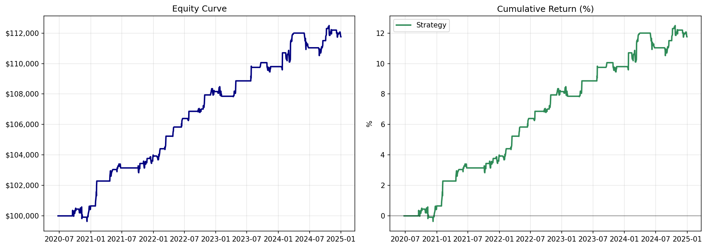

# 01-Stat-Arb-Pairs-Trading

# Statistical Arbitrage: Cointegration‑Based Pairs Trading
**LUV–AAL, 2020–24 Backtest**  
Sharpe Ratio = 1.54 | Annualized Return = 2.49% | Max Drawdown = –1.32%

## Summary
* **Pair Selection**: LUV–AAL (Southwest & American Airlines), OLS hedge ratio β=0.842, ADF stationarity p=0.027.
* **Trading Logic**: Z-score thresholds ±2.0, 16‑day time-stop, dollar‑neutral positions.
* **Backtest window**: Jan 2020–Dec 2024; realistic T-costs = 2 bps/leg.
* **Performance**: 30 round trip trades; Sharpe 1.54, Ann. Return 2.49% (unlevered), Max DD –1.32%.

## How to Reproduce

You can run this analysis in two ways:

### Option 1: Run in Google Colab (recommended)
This opens the notebook directly in Colab (no setup required):

[](https://colab.research.google.com/github/eleubner02/01-Stat-Arb-Pairs-Trading/blob/main/notebooks/pairs_trading_analysis_v1.ipynb)

### Option 2: Run Locally
```bash
# Clone the repo
git clone https://github.com/eleubner02/01-Stat-Arb-Pairs-Trading.git
cd 01-Stat-Arb-Pairs-Trading

# Install dependencies
pip install -r requirements.txt

# Launch the notebook
jupyter notebook notebooks/pairs_trading_analysis_v1.ipynb
```
## Notes & Assumptions

* No leverage used.
* Trading costs fixed at 2 bps per leg.
* Hedge ratio estimated via OLS; strategy keeps positions beta‑neutral.
* No short‑sale constraints assumed.
* Performance is unlevered and not optimized for production deployment.

## Figures




## Out-of-Sample Note (IN PROGRESS)

* OOS 2023-24: Sharpe = X, Y trades, stable vs in-sample.


